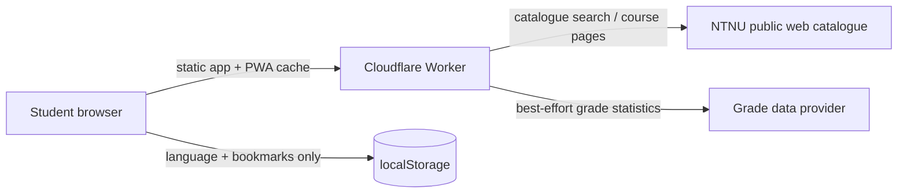

# NTNU Course Search PWA

A bilingual, installable course-catalogue browser built from the supplied functional specification. It uses a Cloudflare Worker as the application server and same-origin gateway for public NTNU course pages.



## Implemented

- Norwegian and English interface, with persisted language choice.
- Persistent local bookmarks; no account or personal-data backend.
- Search, academic year, term, campus, faculty, department, level/type, and catalogue sorting controls.
- Faculty-aware department selector, including automatic parent-faculty selection.
- Optional enrichment for course content, learning outcomes, teaching methods, assessment, work form, attendance evidence, coordinator, and grade badges where available.
- Optional personal-filter lens with bookmark, exam, machine-learning, work-form, online, grade and match controls.
- Invalid enriched-data filter states are disabled and automatically reset when Details is switched off.
- Responsive sortable table on wide screens and cards with infinite-scroll loading on narrow screens.
- Accessible modal with Escape, backdrop and browser/system Back dismissal.
- Installable manifest, service worker, offline application shell, visible focus states and reduced-motion support.
- Loading, empty, upstream-error and degraded fallback states.
- Material 3-inspired tonal surfaces, rounded containers and filter chips.

## Data adapters

The Worker parses NTNU's public A–Å course list and individual public course pages. Public pages change independently of this project, so parsing is defensive and cached. When the upstream catalogue is unreachable, the interface retains a small clearly marked demonstration dataset rather than going blank.

Grade integrations are deliberately honest in the UI:

| Provider | Application status |
|---|---|
| Recent-years grade statistics | Active adapter; values shown only when returned |
| Full-history grade statistics | Active adapter; values shown only when returned |
| HKDIR/DBH | Recognised stub |
| karakterer.net | Recognised as unavailable for this client |

The two active modes share a best-effort public grade-data adapter. A production deployment should pin a documented provider contract or add a maintained database before treating grade coverage as complete.

## Run locally

```bash
npm install
npx wrangler dev
```

Open the local URL printed by Wrangler.

## Temporary claimable Cloudflare deployment

Requires Wrangler 4.102 or later:

```bash
npm install
npx wrangler deploy --temporary
```

Wrangler prints both a temporary `workers.dev` URL and a claim URL. Claim the deployment from that link before it expires.

## Validation performed

- JavaScript syntax checks.
- Cloudflare Worker asset/compile dry run.
- Desktop and mobile browser smoke tests.
- Details-dependent controls enable, disable and reset correctly.
- Language toggle, bookmarks and modal history behavior verified.
- Responsive table/card switching and mobile incremental rendering verified.

## Project structure

```text
.
├── worker.js                 # Worker API gateway and HTML parsers
├── wrangler.jsonc            # Worker/static-assets configuration
├── package.json
└── public/
    ├── index.html
    ├── app.css
    ├── app.js
    ├── manifest.webmanifest
    ├── sw.js
    └── icon.svg
```
